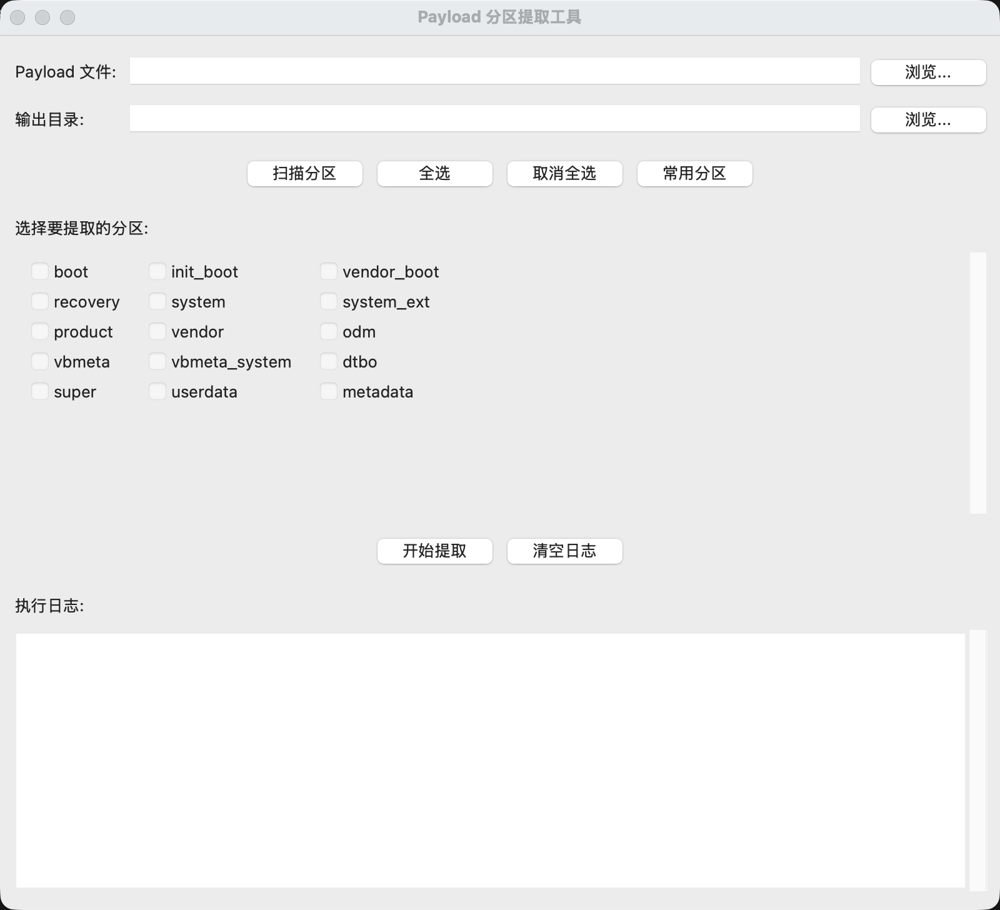

# Payload Extractor GUI

一个简单易用的图形界面工具，用于从 Android OTA 更新包中的 `payload.bin` 文件提取分区镜像。

> **个人自用工具** - macOS 版本
> 
> 本项目代码由 **Claude AI** 协助编写完成。作为个人日常使用的小工具，分享出来希望能帮到有同样需求的朋友。
> 
> 如果你也需要类似工具，欢迎 fork 和修改！

## 🚀 快速开始

**第一次使用？** 请查看下方的 [小白使用指南](#小白使用指南-)，有详细的安装和使用步骤！

## 📸 界面预览

> 💡 **提示**：截图会在后续添加到 `images/` 文件夹中


*图：Payload 分区提取工具主界面*

## 功能特点

- 🎨 **图形化界面** - 简洁直观的 GUI，无需命令行操作
- 📦 **分区选择** - 通过勾选框轻松选择需要提取的分区
- 🔍 **自动扫描** - 自动扫描 payload.bin 中的所有可用分区
- ⚡ **批量提取** - 支持一次性提取多个分区
- 📝 **实时日志** - 实时显示提取进度和结果
- 🎯 **快捷操作** - 全选、取消全选、常用分区快速选择

───────────────────────────┘


### 系统要求

- macOS (已在 macOS 上测试通过)
- Python 3.6+
- tkinter（通常随 Python 一起安装）
- [payload-dumper-go](https://github.com/ssut/payload-dumper-go)

### 安装步骤

#### 1. 安装 Python

确保系统已安装 Python 3.6 或更高版本：

```bash
# 使用 Homebrew 安装（推荐）
brew install python3

# 或从 python.org 下载 macOS 安装包
```

#### 2. 安装 payload-dumper-go

**方法一：使用 Homebrew（推荐）**

```bash
brew install payload-dumper-go
```

**方法二：手动下载**

```bash
# 下载最新版本
wget https://github.com/ssut/payload-dumper-go/releases/latest/download/payload-dumper-go_darwin_amd64.tar.gz

# 解压
tar -xzf payload-dumper-go_darwin_amd64.tar.gz

# 移动到系统路径
sudo mv payload-dumper-go /usr/local/bin/

# 如果是 Apple Silicon (M1/M2/M3)，下载 arm64 版本
wget https://github.com/ssut/payload-dumper-go/releases/latest/download/payload-dumper-go_darwin_arm64.tar.gz
```

#### 3. 验证安装

```bash
payload-dumper-go --version
```

### 使用方法

1. 运行程序：
```bash
python3 payload_extractor_gui.py
```

2. 点击"浏览..."按钮选择 `payload.bin` 文件

3. 点击"浏览..."按钮选择输出目录

4. 点击"扫描分区"自动扫描所有可用分区（或使用默认常见分区）

5. 勾选需要提取的分区：
   - 使用"全选"/"取消全选"批量操作
   - 使用"常用分区"快速选择 boot、init_boot、recovery 等

6. 点击"开始提取"

7. 查看日志窗口了解提取进度

#### 命令行方式（如果你更喜欢）

```bash
# 提取单个分区
payload-dumper-go -p init_boot -o ./output payload.bin

# 提取多个分区
payload-dumper-go -p boot,init_boot,vendor_boot -o ./output payload.bin

# 列出所有分区
payload-dumper-go -l payload.bin
```

### 常见分区说明

| 分区名 | 说明 |
|--------|------|
| `boot` | 内核和 ramdisk |
| `init_boot` | 初始化启动镜像（较新设备） |
| `vendor_boot` | 厂商启动镜像 |
| `recovery` | 恢复模式镜像 |
| `system` | 系统分区 |
| `vendor` | 厂商分区 |
| `product` | 产品分区 |
| `system_ext` | 系统扩展分区 |
| `odm` | ODM 分区 |
| `vbmeta` | 验证启动元数据 |
| `dtbo` | 设备树覆盖 |
| `super` | 动态分区（包含多个逻辑分区） |

### 常见问题

**Q: 提示找不到 payload-dumper-go 命令？**

A: 确保已正确安装 payload-dumper-go。在终端运行 `payload-dumper-go --version` 测试，如果提示找不到命令，请重新安装或检查 PATH 配置。

**Q: 提取失败或卡住？**

A: 
- 确保 payload.bin 文件完整且未损坏
- 检查磁盘空间是否充足（部分分区如 system 可能很大，有些甚至 2-3GB）
- 查看日志窗口中的错误信息

**Q: 需要提取哪些分区来刷机？**

A: 通常需要：
- Root/解锁 Bootloader：`boot.img` 或 `init_boot.img`（新设备）
- 刷入第三方 Recovery：`recovery.img`
- Magisk 修补：通常修补 `init_boot.img` 或 `boot.img`

**Q: 能否提取 super.img 中的逻辑分区？**

A: 本工具只提取 payload.bin 中的分区。要进一步提取 super.img，需要使用 `lpunpack` 等工具。

### 贡献

欢迎提交 Issue 和 Pull Request！

### 许可证

本项目采用 MIT 许可证 - 详见 [LICENSE](LICENSE) 文件

### 致谢

- **Claude AI** - 感谢 Claude 协助完成所有代码编写和调试工作
- [payload-dumper-go](https://github.com/ssut/payload-dumper-go) - 核心提取工具，由 ssut 开发
- Android 开源项目 - 提供了底层技术支持

### 开发故事

这个小工具的诞生源于我个人刷机时频繁需要从 payload.bin 中提取各种分区镜像。每次都要记住复杂的命令行参数实在太麻烦，于是想到用 Python 做个图形界面。

整个项目从想法到完成，全程由 Claude AI 协助编写。包括：
- GUI 界面设计和实现
- 跨平台兼容性处理（特别是修复 macOS 文件对话框的 bug）
- 完整的项目文档

感谢 AI 时代让编程变得更简单！即使不是专业开发者，也能快速实现自己的小工具。

### 相关项目

- [payload-dumper-go](https://github.com/ssut/payload-dumper-go) - Go 语言编写的 payload 提取工具
- [payload_dumper](https://github.com/vm03/payload_dumper) - Python 版本的提取工具

---

## 小白使用指南 🚀

如果你是第一次使用这个工具，按照这个指南一步一步来就可以了！

### 第一步：安装必要的软件

#### 1. 确认已安装 Python

打开**终端**（Terminal），输入：

```bash
python3 --version
```

如果显示类似 `Python 3.x.x`，说明已经安装了。

**如果没有安装 Python**，使用 Homebrew 安装：

```bash
# 先安装 Homebrew（如果还没装）
/bin/bash -c "$(curl -fsSL https://raw.githubusercontent.com/Homebrew/install/HEAD/install.sh)"

# 然后安装 Python
brew install python3
```

#### 2. 安装 payload-dumper-go

这是核心工具，必须安装：

```bash
brew install payload-dumper-go
```

安装完成后验证：

```bash
payload-dumper-go --version
```

如果显示版本号，就说明安装成功了！

### 第二步：下载本项目

#### 方法一：使用 git（推荐）

在终端中输入：

```bash
# 进入你想保存项目的文件夹，比如下载文件夹
cd ~/Downloads

# 克隆项目（把下面的网址换成你的 GitHub 项目地址）
git clone https://github.com/YOUR_USERNAME/payload-extractor-gui.git

# 进入项目文件夹
cd payload-extractor-gui
```

#### 方法二：直接下载 ZIP

1. 在 GitHub 项目页面点击绿色的 **Code** 按钮
2. 选择 **Download ZIP**
3. 下载后解压到某个文件夹
4. 在终端中进入这个文件夹：
   ```bash
   cd ~/Downloads/payload-extractor-gui-main
   ```

### 第三步：运行程序

在终端中，确保你在项目文件夹里，然后运行：

```bash
python3 payload_extractor_gui.py
```

就会弹出图形界面了！🎉

### 第四步：使用工具提取分区

#### 1. 准备 payload.bin 文件

通常从以下地方获取：
- 手机官方 ROM 包（.zip 文件）里解压出来
- OTA 更新包里
- 第三方 ROM 网站下载的完整包

#### 2. 开始提取

在弹出的界面中：

1. **选择 Payload 文件**：
   - 点击第一个"浏览..."按钮
   - 找到你的 `payload.bin` 文件并选择

2. **选择输出目录**：
   - 点击第二个"浏览..."按钮
   - 选择一个文件夹用来保存提取出来的文件

3. **选择要提取的分区**：
   - 点击"扫描分区"按钮，会自动检测所有可用分区
   - 或者直接在列表中勾选你需要的分区
   - 常用选择：
     - ✅ `boot` 或 `init_boot` - 用于 Root/Magisk
     - ✅ `vendor_boot` - 某些设备需要
     - ✅ `recovery` - 刷入第三方 Recovery
     - ✅ `vbmeta` - 禁用 AVB 验证时需要

4. **开始提取**：
   - 点击"开始提取"按钮
   - 等待完成（日志窗口会显示进度）

5. **完成**：
   - 提取的 `.img` 文件会保存在你选择的输出目录中

### 常见用途示例

#### 场景 1：我想 Root 手机（使用 Magisk）

需要提取：
- `init_boot.img`（新设备，如 Android 13+）
- 或 `boot.img`（老设备）

**操作步骤**：
1. 勾选 `init_boot` 或 `boot`
2. 点击"开始提取"
3. 提取出来的 `.img` 文件传到手机
4. 用 Magisk 修补这个文件
5. 用 fastboot 刷入修补后的文件

#### 场景 2：我想刷入 TWRP Recovery

需要提取：
- `recovery.img`

**操作步骤**：
1. 勾选 `recovery`
2. 点击"开始提取"
3. 用 fastboot 刷入：`fastboot flash recovery recovery.img`

#### 场景 3：我想提取所有分区做备份

**操作步骤**：
1. 点击"扫描分区"
2. 点击"全选"
3. 点击"开始提取"
4. 耐心等待（可能需要较长时间，某些分区很大）

### 常见问题解决

#### ❌ 提示找不到 payload-dumper-go 命令

**解决方法**：
```bash
# 重新安装
brew install payload-dumper-go

# 或者检查是否在 PATH 中
which payload-dumper-go
```

#### ❌ 提取失败或卡住

**可能原因**：
1. payload.bin 文件损坏 - 重新下载
2. 磁盘空间不足 - 清理磁盘（system 分区可能 2-3GB）
3. 权限问题 - 选择有写入权限的输出目录

#### ❌ 点击"浏览..."后程序崩溃

这个 bug 已经修复了，确保使用最新版本的代码。

#### ❌ 不知道该提取哪些分区

点击"常用分区"按钮，会自动选择最常用的几个：
- boot
- init_boot
- vendor_boot
- recovery
- vbmeta
- dtbo

### 快捷方式（可选）

如果你经常使用，可以创建一个快捷启动脚本：

1. 创建文件 `start.sh`：
```bash
#!/bin/bash
cd ~/Downloads/payload-extractor-gui
python3 payload_extractor_gui.py
```

2. 添加执行权限：
```bash
chmod +x start.sh
```

3. 以后双击 `start.sh` 就可以启动了！

或者直接在终端添加别名：
```bash
# 将这行加入 ~/.zshrc 或 ~/.bash_profile
alias payload='cd ~/Downloads/payload-extractor-gui && python3 payload_extractor_gui.py'
```

然后只需要输入 `payload` 就能启动程序。

### 需要帮助？

- 提交 Issue 到 GitHub
- 查看上方的常见问题
- 搜索相关刷机论坛

---

**提示**：第一次使用可能觉得复杂，但实际操作一次后就会很简单了！加油！💪

---

## License

MIT License - 详见 [LICENSE](LICENSE) 文件
